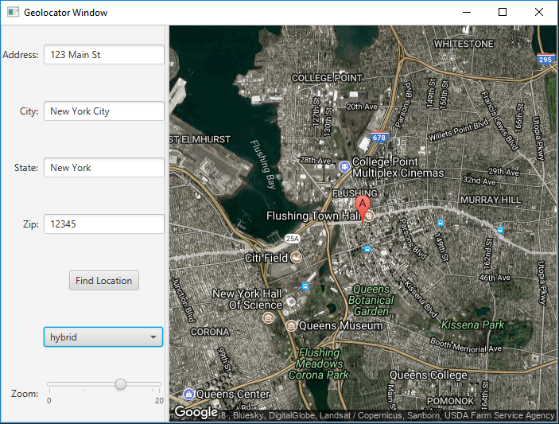

# Simple Geolocator Popup

Simple geolocator that uses Google APIs to locate a marker on a map and is built on top of the JavaFX library.

### Features
* Uses Google's geocoding API to return parsed XML with latitude and longitude of address/location entered into GUI.
* Uses Google's maps API to return static map focused on lat/long marker.
* Toggle between 4 google map types.
* Zoom slider control.

## License

This project is licensed under the MIT License - see the [LICENSE.md](LICENSE.md) file for details